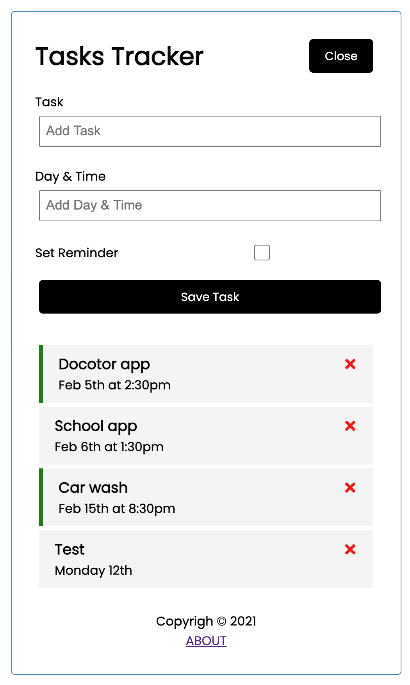

# REACT (Task Tracker App)

This project includes the react UI as well as JSON-server for the backend
Please find demo website here: http://react-tasks.surge.sh/

## Usage

### Install dependencies

```
npm install
```

### Run React dev server (http://localhost:3000)

```
npm start
```

### Run the JSON server (http://localhost:5000)

```
npm run server
```

### To build for production

```
npm run build
```
